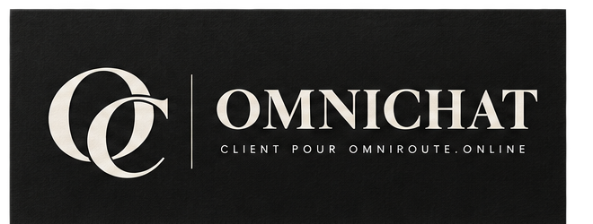
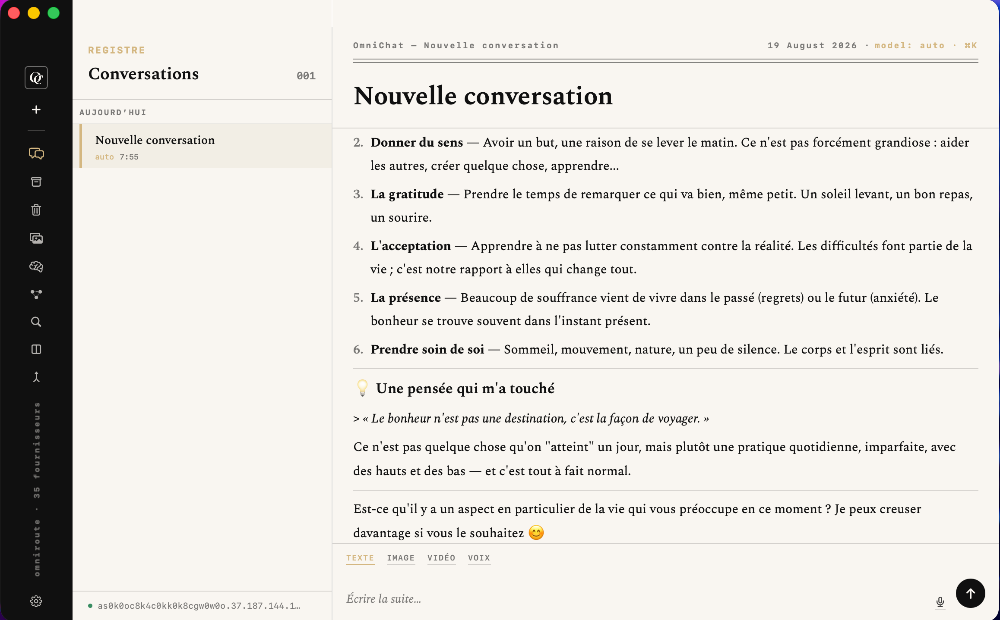
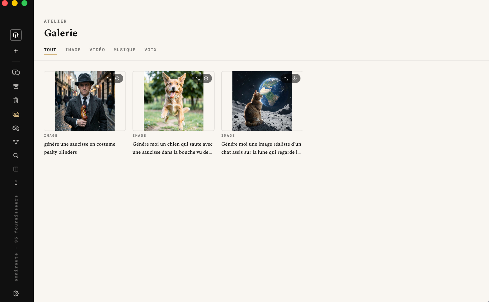
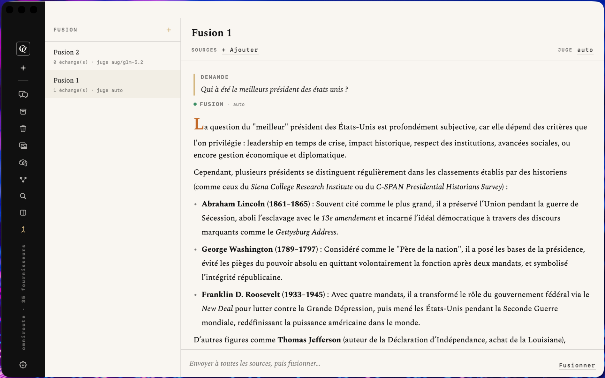
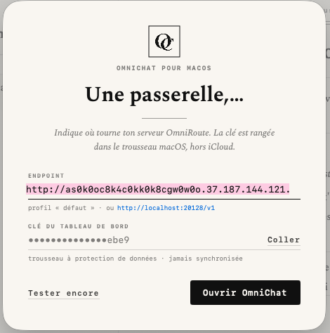

<div align="center">



**Client macOS natif pour [OmniRoute](https://github.com/diegosouzapw/OmniRoute)**
Chat multi-modèles, génération média, mémoire, MCP, RAG, comparaison et fusion de réponses.

[](#build--lancement)
[](#build--lancement)
[](#build--lancement)
[](#architecture)
[](LICENSE)

[](https://github.com/cyprienbrisset/omnichat/commits/main)
[](https://github.com/cyprienbrisset/omnichat)
[](https://github.com/cyprienbrisset/omnichat)

**[Aperçu](#aperçu) · [Fonctionnalités](#fonctionnalités) · [Architecture](#architecture) · [Build & lancement](#build--lancement) · [Configuration](#configuration)**

</div>

---

## Aperçu

<table>
<tr>
<td width="50%">

<br/><sub align="center">Chat en streaming, rendu markdown natif</sub>
</td>
<td width="50%">

<br/><sub align="center">Galerie — génération média</sub>
</td>
</tr>
<tr>
<td width="50%">

<br/><sub align="center">Fusion — N modèles + synthèse par un juge</sub>
</td>
<td width="50%">

<br/><sub align="center">Configuration — endpoint et clé API</sub>
</td>
</tr>
</table>

## Qu'est-ce qu'OmniChat ?

OmniChat est une application macOS native (Swift 6 + SwiftUI) qui exploite
[OmniRoute](https://github.com/diegosouzapw/OmniRoute), une passerelle IA
open-source agrégeant plusieurs centaines de fournisseurs de modèles
derrière une API compatible OpenAI.

## Fonctionnalités

| Domaine | Ce qui est fait |
| --- | --- |
| **Chat** | Streaming multi-modèles, routage automatique (`auto`) ou modèle choisi par conversation (⌘K), trace de routage et coût réels par réponse |
| **Génération média** | Images, vidéo, musique, synthèse et transcription vocale — rendu inline + Galerie dédiée |
| **Fil de conversation** | Markdown natif, copie en un clic, appels d'outils agentiques (`tool_calls` réels), auto-scroll pendant le streaming |
| **Mémoire & MCP** | Navigateurs réels de la mémoire serveur et du serveur MCP embarqué d'OmniRoute (API de gestion) |
| **Recherche locale (RAG)** | Indexation manuelle de l'historique, recherche sémantique + mots-clés, attache de contexte au message suivant |
| **Comparaison** | Un même prompt envoyé à N modèles, réponses indépendantes côte à côte |
| **Fusion** | N modèles sources + synthèse par un modèle juge (auto ou choisi), persistance dédiée |
| **Administration** | Panneau à 8 pages (fournisseurs & clés, santé, agents, garde-fous, réseau, analytique & coûts) — quota restant par fournisseur, visible uniquement si la clé a les droits de gestion |
| **Bulletin menu bar** | Santé des fournisseurs, quota global, requêtes/succès/P50, dernière bascule et dernière réponse routée — sans quitter la barre de menu |

Détail complet et décisions de conception : [docs/DEVLOG.md](docs/DEVLOG.md).
Périmètre complet et architecture cible :
[docs/superpowers/specs/2026-08-17-omnichat-macos-app-design.md](docs/superpowers/specs/2026-08-17-omnichat-macos-app-design.md).

**Pas encore implémenté :**


— voir la feuille de route dans le spec ci-dessus.

## Architecture

```
OmniChat/                  App SwiftUI (macOS 26+)
Packages/OmniRouteKit/     Client réseau OmniRoute (Swift Package local)
docs/                      Specs, journal de développement, identité de marque
```

- **`OmniRouteKit`** — client HTTP/SSE vers OmniRoute (streaming chat,
  génération média, admin, transcription…), testé indépendamment de l'UI.
- **Persistance locale** — SwiftData (conversations, messages, médias,
  sessions Fusion), aucune synchronisation cloud.
- **Clé API** — Keychain macOS à protection de données, jamais en clair,
  jamais synchronisée via iCloud.
- **Projet sœur** — [Omni Code](https://github.com/cyprienbrisset/omnicode)
  (dépôt séparé), un CLI de développement type Claude Code propulsé par le
  même serveur OmniRoute, en Node.js/TypeScript.

## Build & lancement

Prérequis : Xcode récent, [XcodeGen](https://github.com/yonaskolb/XcodeGen), macOS 26+.

```bash
xcodegen generate
open OmniChat.xcodeproj
```

```bash
# Tests du socle réseau (rapide, sans Xcode)
cd Packages/OmniRouteKit && swift test

# Tous les tests (kit + app)
xcodebuild test -project OmniChat.xcodeproj -scheme OmniChat -destination 'platform=macOS'
```

> **Compte Apple Developer local requis.** L'app stocke la clé API dans le
> trousseau à protection de données (`kSecUseDataProtectionKeychain`), ce
> qui exige une signature de code réelle. `project.yml` configure
> `CODE_SIGN_STYLE: Automatic` sans figer d'équipe — renseigne la tienne
> via `DEVELOPMENT_TEAM=...` ou dans Signing & Capabilities après
> `open OmniChat.xcodeproj`.

## Configuration

Au premier lancement, ouvre **OmniChat › Réglages** pour renseigner l'URL
de ton instance OmniRoute (`http://localhost:20128/v1` par défaut, ou une
instance distante) et ta clé API. « Tester la connexion actuelle » appelle
réellement `GET /v1/models` pour confirmer que l'endpoint et la clé sont
valides. Si la clé a les droits de gestion, les Réglages affichent aussi
les chiffres réels de fournisseurs configurés/actifs sur le catalogue
total.

## Licence

Tous droits réservés — voir [LICENSE](LICENSE). Code visible publiquement
à titre de portfolio ; aucune réutilisation autorisée sans accord.
